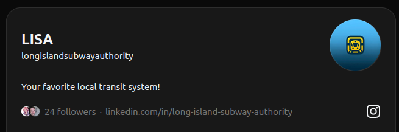
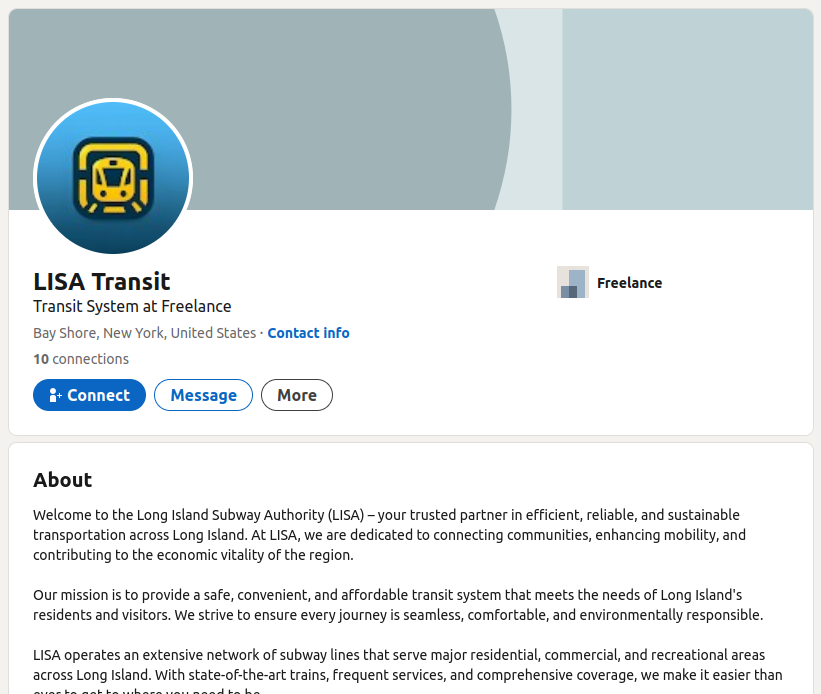
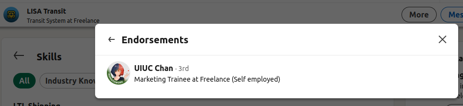
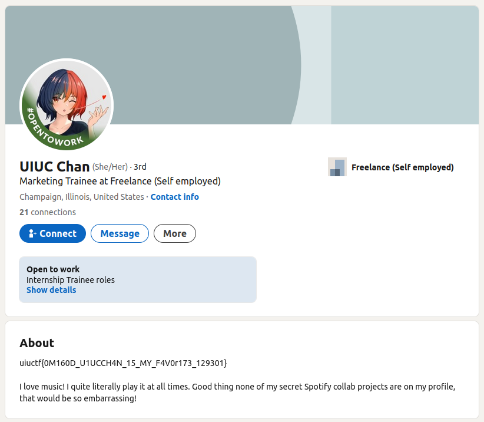
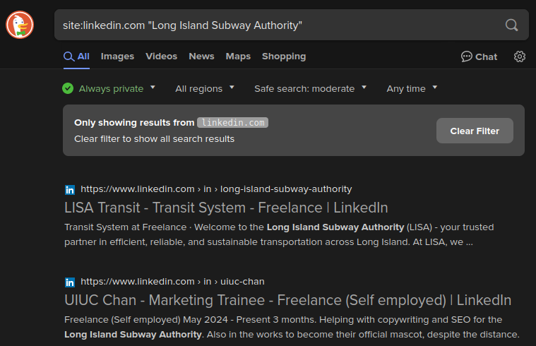

# "An Unlikely Partnership" Solution Writeup

This is the solution for "An Unlikely Partnership", the second challenge in the UIUC-Chan suite. It's an OSINT challenge that shows how social media can be used to identify connections between two individuals. I recommend starting with "Hip With the Youth" before reading the writeup for this challenge.

> This writeup was originally created in July 2024 as part of UIUCTF 2024. The original copy of this writeup can be found in the [UIUCTF 2024 Public Release Repository](https://github.com/sigpwny/UIUCTF-2024-Public/blob/main/challenges/osint/an-unlikely-partnership/challenge/SOLVE.md).

We start with the following description:

```
It appears that the Long Island Subway Authority (LISA) has made a strategic business partnership with a surprise influencer! See if you can figure out who. 
```

And the Threads account we found in the previous challenge:



The Threads account contains a link to a LinkedIn profile. If you follow the link, you will find a LinkedIn profile for a user named "LISA Transit":



The profile includes posts and experience, and while the user has connections, without being able to follow them you cannot see who they are. However, you can see the user has a skill endorsement from a user named "UIUC-Chan":



If you click on the profile, you will find that UIUC-Chan's bio contains the flag:



The flag is `uiuctf{0M160D_U1UCCH4N_15_MY_F4V0r173_129301}`.


> [!TIP]
> If you wanted to complete the challenge before solving "Hip With the Youth", you could have found the LinkedIn profile by using a filter when searching for "Long Island Subway Authority" on your favorite search engine:
>
> 
>
> However, the Threads account is the intended and most straightforward path to the LinkedIn profile.